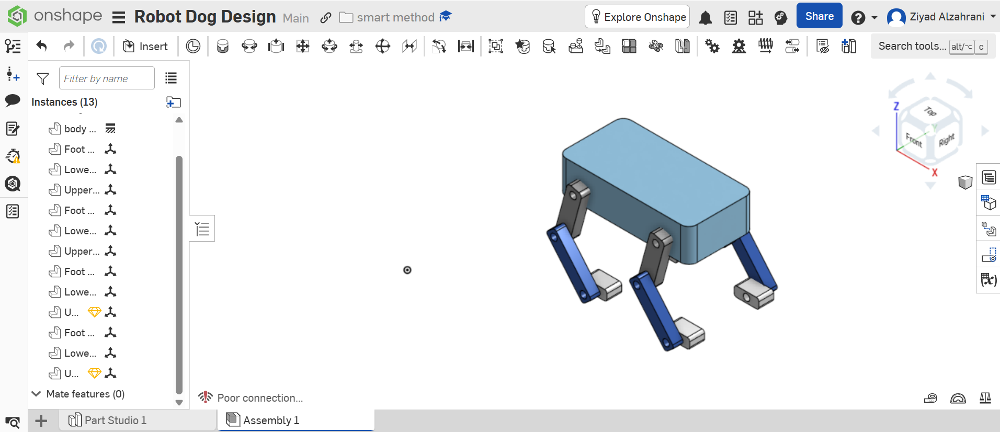
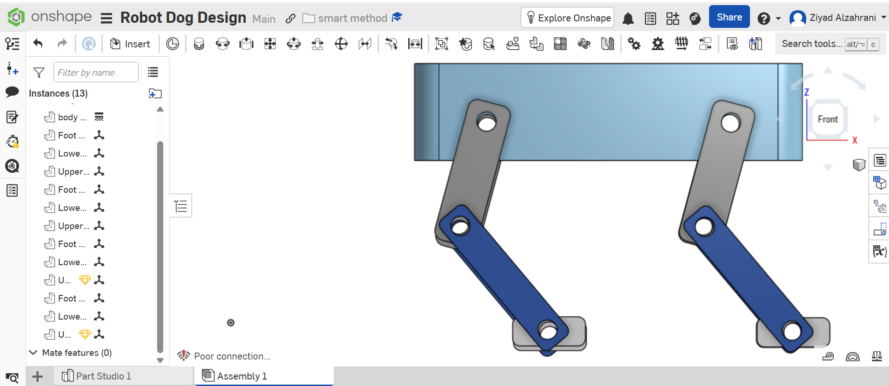
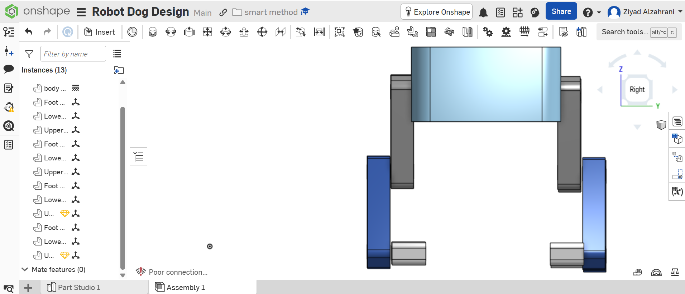
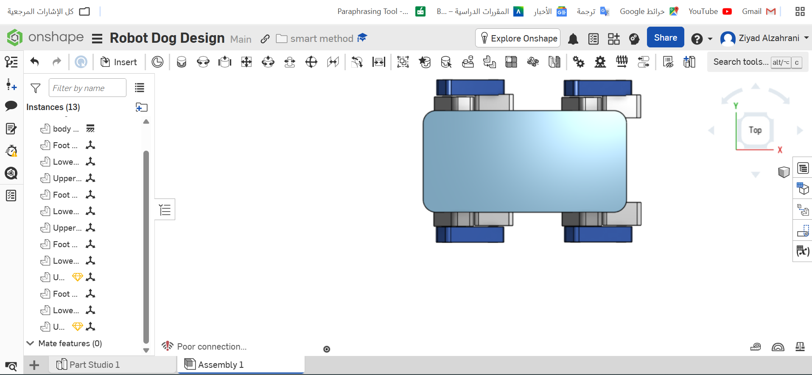

# Robot Dog Design

A simple mechanical design of a quadruped robot dog created using Onshape.

---

## Project Overview

This project presents the mechanical design of a four-legged robot dog.

The main objective is to understand the basic mechanical structure of quadruped robots, including:

- Body design
- Leg structure
- Joint design
- Degrees of freedom
- Motor selection
- Torque estimation
- Stability
- Center of gravity
- Walking gait
- Expected mechanical challenges

---

## Onshape Design

The complete design can be viewed using the following Onshape link:

[Open Robot Dog Design in Onshape](https://cad.onshape.com/documents/2f37565b7dda4f9cdaa84f28/w/a9d08de224c3f65159c442de/e/2a735648cd6dfe2d468ac30c?renderMode=0&uiState=6a5c918ef648b00d07e640a0)

---

## Software Used

- Onshape
- GitHub

---

## Mechanical Components

The robot consists of:

- 1 Main Body
- 4 Upper Legs
- 4 Lower Legs
- 4 Feet

The body supports the mechanical components and provides the main structure of the robot.

Each leg is divided into an upper leg, lower leg, and foot.

---

## Body Design

The main body was designed as a rectangular structure with rounded corners.

Approximate body dimensions:

- Length: 160 mm
- Width: 80 mm
- Height: 40 mm

The rounded corners improve the appearance of the design and reduce sharp edges.

---

## Leg Design

Each leg contains three main components:

1. Upper Leg
2. Lower Leg
3. Foot

The upper leg is connected to the body using a hip joint.

The lower leg is connected to the upper leg using a knee joint.

The foot is attached to the lower leg to provide contact with the ground.

---

## Joint Design

Each leg contains two main revolute joints:

- Hip Joint
- Knee Joint

The revolute joints allow rotational motion between the connected parts.

Total number of revolute joints:

- 2 joints per leg
- 4 legs
- Total = 8 revolute joints

---

## Degrees of Freedom

Each revolute joint provides one degree of freedom.

For each leg:

- Hip Joint = 1 DOF
- Knee Joint = 1 DOF

Therefore:

```text
2 DOF × 4 Legs = 8 DOF
```

The complete robot has a total of 8 degrees of freedom.

---

## Motor Selection

The suggested motor for the robot is:

```text
MG996R Servo Motor
```

Reasons for selecting this motor:

- Affordable
- Easy to control
- Commonly available
- Suitable for educational projects
- Provides enough torque for a lightweight prototype
- Can rotate the hip and knee joints

Each joint requires one servo motor.

Therefore, the robot requires approximately:

```text
8 Servo Motors
```

---

## Preliminary Torque Calculation

The torque is estimated using:

```text
Torque = Force × Distance
```

Assumptions:

- Estimated robot mass = 1.5 kg
- Load distributed equally between four legs
- Mass supported by one leg = 1.5 ÷ 4 = 0.375 kg
- Gravitational acceleration = 9.81 m/s²
- Approximate leg distance = 0.13 m

Force on one leg:

```text
Force = Mass × Gravity
Force = 0.375 × 9.81
Force ≈ 3.68 N
```

Estimated torque:

```text
Torque = 3.68 × 0.13
Torque ≈ 0.48 N·m
```

A safety factor should be used because the robot may experience additional force during movement.

Recommended motor torque:

```text
Greater than 1 N·m
```

---

## Stability

The robot uses four legs to create a stable support area.

When all four feet touch the ground, they form a support polygon.

The robot remains stable when the center of gravity stays inside this support polygon.

Factors that improve stability:

- Wide distance between the legs
- Low body position
- Equal load distribution
- Flat feet
- Slow leg movement
- Correct alignment of the legs

---

## Center of Gravity

The center of gravity is expected to be near the center of the main body.

Placing heavy components such as the battery and control system near the center helps improve balance.

A low center of gravity also reduces the possibility of tipping.

The body should be positioned so that the center of gravity remains between the four legs.

---

## Proposed Walking Gait

The proposed walking method is the Crawl Gait.

In this gait, only one leg moves at a time while the other three legs remain on the ground.

Suggested sequence:

1. Front Left Leg
2. Rear Right Leg
3. Front Right Leg
4. Rear Left Leg

Advantages of Crawl Gait:

- High stability
- Simple control
- Suitable for slow movement
- Reduces the possibility of falling

This project focuses on the mechanical design, and no walking animation was implemented.

---

## Expected Mechanical Challenges

Possible mechanical problems include:

- Joint friction
- Limited servo torque
- Body vibration
- Incorrect leg alignment
- Loose joints
- High load on the motors
- Foot slipping
- Difficulty maintaining balance
- Unequal weight distribution
- Mechanical stress around joint holes

---

## Possible Improvements

Future improvements may include:

- Adding servo motor holders
- Adding a battery compartment
- Adding an electronics cover
- Using stronger materials
- Adding bearings to reduce friction
- Increasing the foot contact area
- Adding a third degree of freedom to each leg
- Creating a walking simulation
- Printing the design using a 3D printer

---

## Files

The repository includes the following files:

- `Robot_Dog_Design.stl`
- `Front-View.png`
- `Side-View.png`
- `Top-View.png`
- `Isometric-View.png`
- `README.md`

---

## Design Images

### Isometric View



### Front View



### Side View



### Top View



---

## Conclusion

This project demonstrates the basic mechanical design of a quadruped robot dog.

The design includes a main body, four legs, upper and lower leg sections, feet, revolute joints, and eight degrees of freedom.

The project also includes a preliminary motor selection, torque calculation, stability analysis, center of gravity discussion, walking gait proposal, and expected mechanical challenges.

The design was created using Onshape and exported in STL format for viewing or 3D printing.
