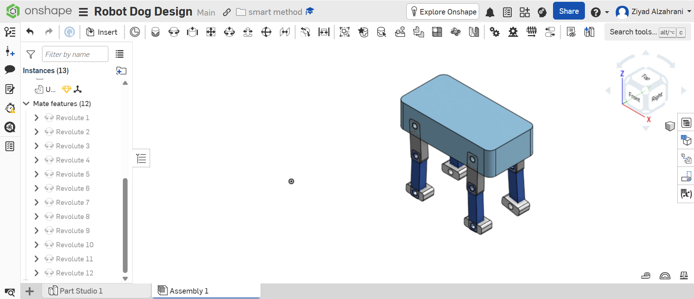
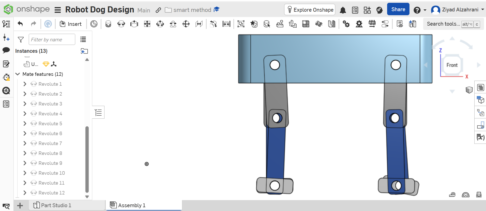
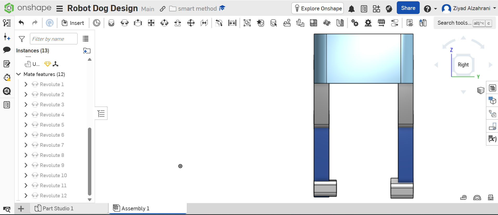
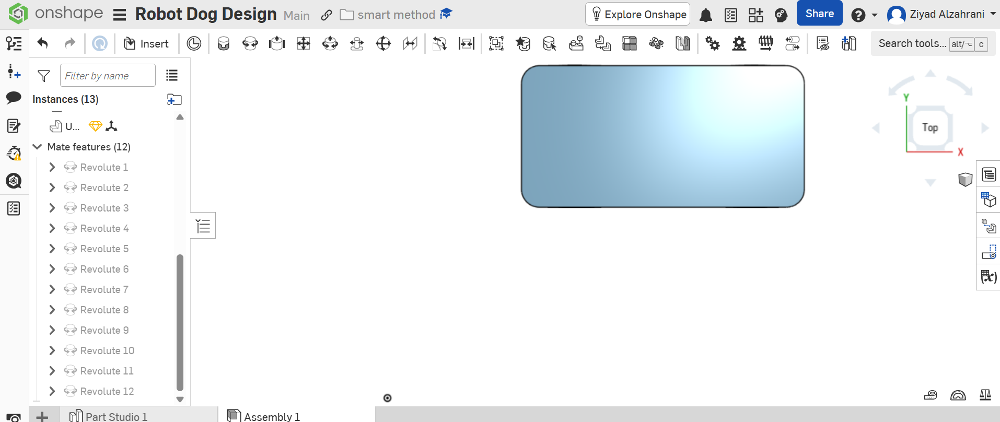

# Robot Dog Design - Task 3

## Overview

This project presents a quadruped robot dog designed using **Onshape** with a parametric CAD approach.

The robot consists of a main body and four legs connected using revolute joints, allowing the legs to move inside the assembly.

---

## Software Used

- Onshape
- GitHub

---

## Onshape Design

Project Link:

https://cad.onshape.com/documents/2f37565b7dda4f9cdaa84f28/w/a9d08de224c3f65159c442de/e/2a735648cd6dfe2d468ac30c?renderMode=0&uiState=6a60d7c92ec24abcf688abd8

---

## Files

- robot-dog-design.stl
- Front-View.png
- Side-View.png
- Top-View.png
- Isometric-View.png

---

## Design Images

### Isometric View

### Front View

### Side View

### Top View

